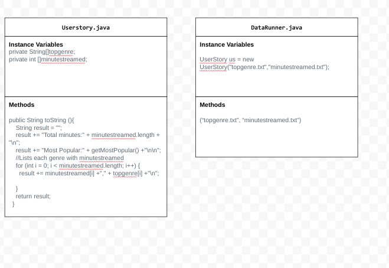

# Data-for-Social-Good-Project
Software engineers develop programs to work with data and provide information to a user. Each user has different needs based on the information they are looking for from data. Your goal is to create a data analysis program for your user that stores and analyzes data to provide the information they need.
Project Requirements
Use your knowledge of object-oriented programming, one-dimensional (1D) arrays, and algorithms to create your data analysis program:
Write a class – Write a class to represent your user or business and store and analyze their data with no-argument and parameterized constructors.
Create 1D arrays – Create 1D arrays to store the data that your user needs information about.
Write a method – Write a method that finds or manipulates the elements in a 1D array to provide the information your user needs.
Implement a toString() method – Write a toString() method that returns general information about the data (for example, number of values in the dataset).
Document your code – Use comments to explain the purpose of the methods and code segments and note any preconditions and postconditions.
Optional Features
Incorporate user interaction – Use methods in the Scanner class to obtain user input to interact with your data analysis program.
Use inheritance and polymorphism – Create classes to represent the types of data with overridden methods and use a 1D array of a superclass type to store the objects.

Project Rubric
Category
Extensive Evidence
Convincing Evidence
Limited Evidence
No Evidence
Object-Oriented Programming
Writes a UserStory class to represent the user or business and store and analyze their data.

AND

Creates and utilizes a custom class with accessor methods to represent each data entry.
Writes a UserStory class to represent the user or business and store and analyze their data.

AND

Implements a no-argument and/or parameterized constructor.

Writes a class to represent the user or business and store and analyze their data.

AND

Attempted to implement a no-argument constructor or parameterized constructor, but there are some syntax errors with the constructor methods.
Does not write a class to represent the user or business and store and analyze their data.
One-Dimensional (1D) Arrays
Creates more than one one-dimensional (1D) array by reading the contents of text files into the 1D arrays.

AND

Creates a new 1D array containing values to address a question for the scenario.
Creates more than one one-dimensional (1D) array by reading the contents of text files into the 1D arrays.
Creates one one-dimensional (1D) array by reading the contents of a text file into the 1D array.

OR

Creates one one-dimensional (1D) array using an initializer list to assign values.
Does not create a one-dimensional (1D) array.
Methods
Writes more than one method that finds or manipulates the elements in the  one-dimensional (1D) array in the program.
Writes one method that finds or manipulates the elements in each one-dimensional (1D) array in the program.
Writes one method that finds or manipulates the elements in one one-dimensional (1D) array in the program, but there are some syntax errors with the methods.
Does not write a method that finds or manipulates the elements in a one-dimensional (1D) array in the program.
toString() Method
Writes a toString() method that returns detailed information about the class and its data.
Writes a toString() method that returns basic information about the class and its data.
Writes a toString() method that does not provide information about the class or its data.
Does not write a toString() method to return information about the class or its data.
Documentation
Uses multi-line comments to explain the functionality and purpose of ALL methods in the classes, and uses some single line comments to explain code segments
Uses multi-line comments to explain the functionality and purpose of MOST methods in the classes.

OR

Uses single-line comments to explain the functionality and purpose of ALL methods in the classes.
Uses single-line or multi-line comments to explain the functionality and purpose of only ONE method in the class.
Does not use comments to document the functionality and purpose of methods or code segments in the program.
GitHub
A GitHub repository is initialized with a README.md file, and all .java files for the project are added to the repository. The README template is used with all the following parts complete:
- User Story
- Dataset
- UML Diagram
- Description
A GitHub repository is initialized with a README.md file, and all .java files for the project are added to the repository.  The README template is used with ALL BUT ONE the following parts complete:
- User Story
- Dataset
- UML Diagram
- Description

A GitHub repository is initialized with a README.md file, and all .java files for the project are added to the repository.  The README template is used with ALL BUT TWO the following parts complete:
- User Story
- Dataset
- UML Diagram
- Description
There is no GitHub repository on the personal account for this project.

OR

.java files not properly uploaded, or the README is blank / template not used.

Presentation Rubric
Category
Extensive Evidence
Convincing Evidence
Limited Evidence
No Evidence
User Story
Explains the user story adequately, covering role, goal, and benefit. Shows a good understanding of its relevance to the project.
Explains the user story adequately, covering role, goal, and benefit. Shows a good understanding of its relevance to the project.
Presents the user story but lacks clarity in explaining one or more components (role, goal, or benefit). Connection to the project is somewhat vague.
Poorly explains the user story or omits key components. Fails to connect it meaningfully to the project.
Dataset and Relevance
Thoroughly describes the chosen dataset, its source, and its structure. Clearly explains how the dataset relates to and addresses the user story.
Adequately describes the dataset and its source. Explains the connection between the dataset and the user story.
Provides basic information about the dataset but lacks detail. Connection to the user story is unclear or weak.
Minimal description of the dataset. Fails to explain its relevance to the user story.
Java Concepts and Vocabulary
Consistently and accurately uses vocabulary throughout the presentation. Demonstrates a deep understanding of Java concepts, particularly 1D arrays and methods.
Uses vocabulary frequently and mostly accurately. Shows good understanding of relevant Java concepts.
Occasionally uses vocabulary, with some inaccuracies. Demonstrates basic understanding of Java concepts.
Rarely uses vocabulary or uses it incorrectly. Shows limited understanding of Java concepts.
Code Explanation
Clearly explains the structure and functionality of their Java application, focusing on 1D arrays and methods. Provides insightful comments on design decisions.
Adequately explains the main components of their Java application, including 1D arrays and methods. Offers some insight into design choices.
Provides a basic explanation of their Java application but lacks detail or clarity, especially regarding 1D arrays and methods.
Poorly explains their Java application, with little to no focus on 1D arrays and methods.
Data Manipulation and Analysis
Thoroughly explains how their application manipulates and analyzes data using 1D arrays and methods. Clearly demonstrates the connection between code functionality and addressing the user story.
Adequately explains data manipulation and analysis techniques used in their application. Shows how these relate to the user story.
Provides a basic explanation of data manipulation and analysis but lacks detail or clear connection to the user story.
Poorly explains or fails to address how their application manipulates and analyzes data.
Presentation Skills and Teamwork
Delivers a well-organized, engaging presentation with smooth transitions between team members. Both partners demonstrate equal understanding and contribution.
Presents information clearly with good coordination between team members. Both partners contribute, though one may dominate slightly.
Presentation is somewhat disorganized or unbalanced between team members. Some aspects may be unclear or poorly explained.
Disorganized presentation with poor coordination between team members. One partner may dominate entirely or both may struggle to explain their project.

Step 1: Choose your user
Create your own user story for your program. For your user or business, list the questions they might have or the information they need.
Create Your Own
As a music enthusiast I want to analyze the most listened to genre so that I can find what genre is the most popular.

Possible Extensions: Number of Songs, Genres, Minutes streamed

Possible Questions: How many genre are there? Most listened to artist? Top 3 genres?

Step 2: Getting Data
Finding datasets online can be daunting, here are some websites data contain a bunch of datasets you can search start:

Kaggle, https://www.kaggle.com/
Data.gov, https://catalog.data.gov/dataset
World Bank, https://databank.worldbank.org/home.aspx
UNICEF, https://data.unicef.org/resources/resource-type/datasets/
United States Census Bureau, https://data.census.gov/cedsci/
U.S. Bureau of Labor Statistics, https://www.bls.gov/data/
NASA, https://data.nasa.gov/browse

There are many other websites with datasets in addition to these that you can explore and use!

You must find a data set that can be downloaded as a .csv or .xlsx file (most common file format for spreadsheets). If you can download as .csv or .xlsx file, you will need to manually copy over the column of data to a Google Sheet before creating a .txt file.

Use Google Sheets to format/clean your data before making .txt files.
Open the .csv or .xlsx file in Google Sheets to format and clean your data.
Use some of Google Sheets function to help clean the data
Ctrl + Shift + V pastes data WITHOUT FORMATING (this will paste the raw data not with any formulas and relative values)

See Unit 3 - Instructions & Resources for more instructions or ask Aiello

Step 3: Create UML diagrams for your classes
Software engineers often use UML diagrams (Unified Modeling Language) to represent the classes in a program.
A UML diagram for a class is a rectangle that is divided into three sections: the first section for the name of the class, the second section for its instance variables, and the third section for its methods.
Create a UML diagram for your class that will represent your user and any additional classes you might need.

Click the image to the left and choose “Edit” to make your UML on this document, or Click Here to go to a separate Google Drawing.
Save this image so you can include it on your README.md when you commit your project to GitHub!

